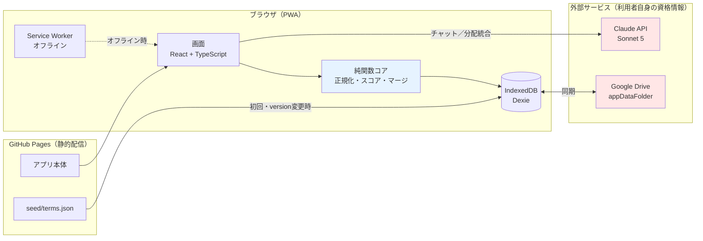
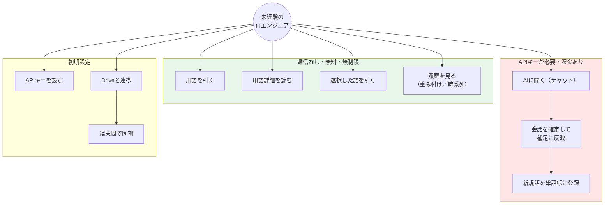
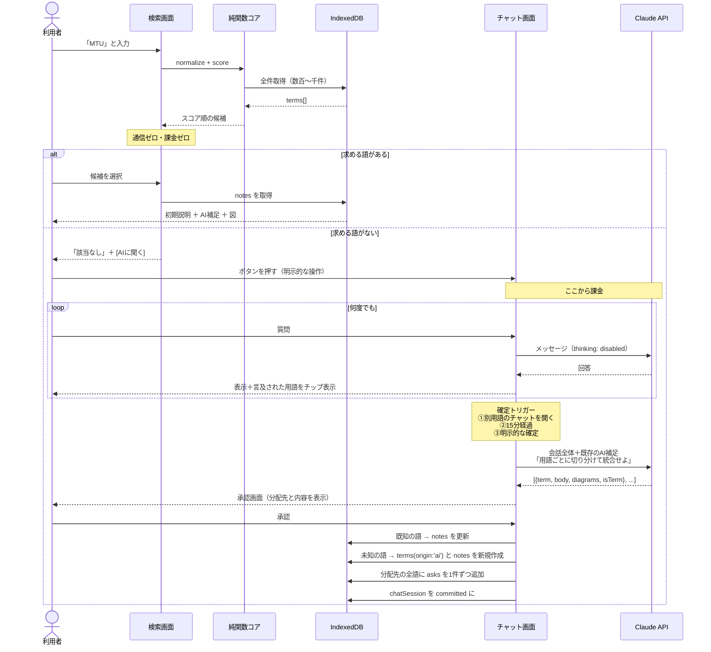
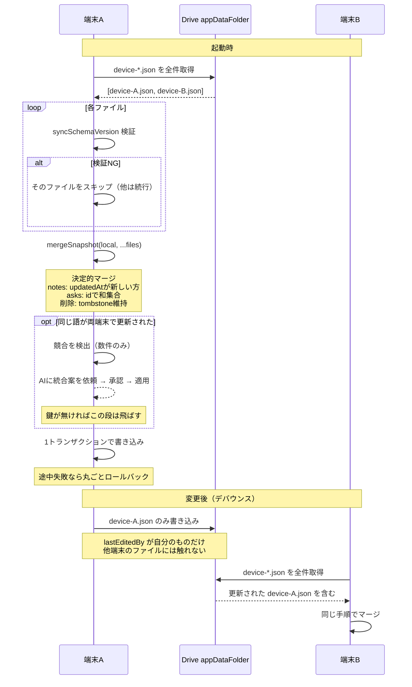
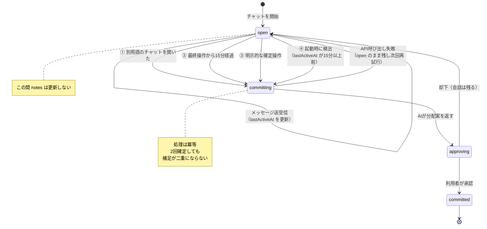
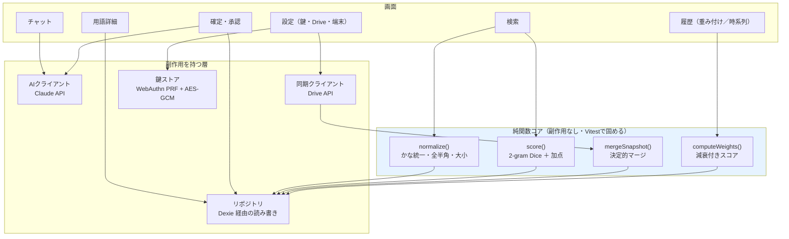
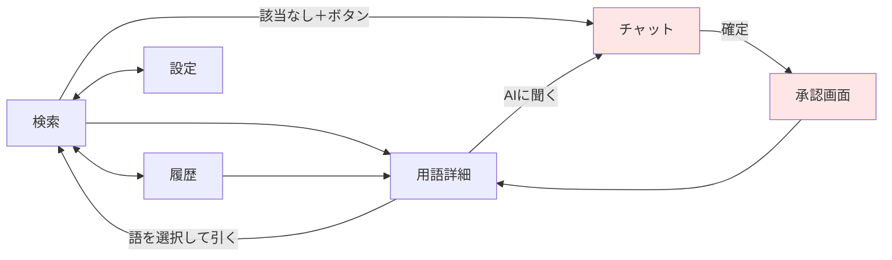

# IT-Index アーキテクチャ

- 版: 1.0（2026-07-24）
- 前提: [要件定義書](./requirements.md) / [初期データ形式仕様](./seed-format.md)

図はすべて Mermaid。GitHub 上でそのまま描画される（アプリ本体でも Mermaid を使うので技術が一貫する）。

---

## 1. 全体構成

**自前のサーバーを持たない。** ブラウザが直接、利用者自身の資格情報で外部APIを呼ぶ。



- 🔴 **赤 = 課金・通信が発生する境界。** 検索と閲覧はここを通らない
- 🔵 **青 = 純関数として切り出す部分。** 単体テストで固める対象

---

## 2. ER図

**同期対象かどうかが設計の要**なので、色で示す。

```mermaid
erDiagram
    terms ||--o| notes : "1用語に1件"
    terms ||--o{ asks : "聞かれた記録"
    chatSessions ||--o{ chatMessages : "会話の中身"
    chatSessions ||--o{ asks : "この会話で生まれた"
    terms ||--o{ chatSessions : "用語から開いた場合のみ"

    terms {
        string id PK "termから決定的に生成"
        string term "見出し語"
        string_array readings "読み（原則1要素）"
        string summary "初期説明（不変・AIは触らない）"
        string field "分野（seed-format §5 の一覧）"
        string_array tags "任意"
        string searchKey "正規化済み・事前計算"
        string_array readingKeys "正規化済み・事前計算"
        string origin "seed | ai"
        number createdAt
        number updatedAt
        number deletedAt "tombstone"
    }

    notes {
        string termId FK
        string body "AI補足テキスト（Markdown）"
        string_array diagrams "Mermaid文字列（テキストと分離）"
        number updatedAt
        string lastEditedBy "deviceId"
        object_array noteHistory "版・同期対象外"
    }

    asks {
        string id PK
        string termId FK
        string sessionId FK
        number at
        string deviceId
    }

    chatSessions {
        string id PK
        string termId FK "null可（自由チャット）"
        number startedAt
        number lastActiveAt
        string status "open | committed"
    }

    chatMessages {
        string id PK
        string sessionId FK
        string role "user | assistant"
        string content
        number at
    }

    settings {
        string deviceId "この端末の識別子"
        string driveToken
        string seedVersion "取り込み済みの版"
    }
```



### 同期対象の区分

| テーブル | Drive同期 | 理由 |
|---|---|---|
| `terms` | **しない**（例外あり） | 配信データ由来で全端末同じ。`version` で入れ替えるだけ |
| `notes` | **する** | **端末ごとに育つ唯一のデータ** |
| `asks` | **する** | 追記のみ。`id` で和集合。重み付けの計算元 |
| `chatSessions` / `chatMessages` | **しない** | 共有すべきは統合された結果であって、過程ではない |
| `settings` | **しない** | 端末固有。**APIキーは含めない** |

> **例外**: `origin: 'ai'` の語（初期データに無く、チャットから登録された語）は他端末に存在しないため、`terms` も同期対象に含める。

### 設計上の要点

| 決定 | 理由 |
|---|---|
| **`summary` と `notes.body` を別テーブルに分ける** | 初期データを更新配信しても**AI補足が上書きされない**。構造で保証する |
| **`diagrams` を `body` と分ける** | Mermaid構文エラーが**テキストを巻き添えにしない**。構造で保証する |
| **`asks` にカウンタを持たず、ログで持つ** | カウンタは同期で壊れる（新しい方を採ると消える／合算すると二重計上）。ログの和集合なら**何度マージしても結果が同じ** |
| **`searchKey` / `readingKeys` を事前計算** | 検索のたびに正規化しない。**後から正規化ルールを変えると全件再計算が必要**なので最初に固める |

---

## 3. ユースケース図



**鍵が無くても緑の枠はすべて動く。** 審査員や初見の利用者が、何も設定せずに辞書として使える。

---

## 4. シーケンス図

### 4.1 検索 → チャット → 確定 → 分配統合

**このアプリの中核の流れ。**



**要点:**

- **検索は一切通信しない。** 課金の入口は `[AIに聞く]` ボタン1つだけ
- **対話中は `notes` を更新しない。** 確定時に1回だけ。繰り返し統合による劣化を防ぐ
- **分配は必ず承認を挟む。** AIの切り分けミスが直接データを壊さない
- **`asks` は分配先の語ごとに立つ。** 重み付けの加算元がここ

### 4.2 同期



**要点:**

- **各ファイルの書き手が1台だけ。** 取り合いが起きないので更新消失が構造的に発生しない
- **1ファイルが壊れても他は読める。** 端末ごとに分けたことの副次効果
- **AI補助は任意。** 鍵が無くても決定的マージだけで同期は完結する

### 同期ファイル（`device-*.json`）の構造

```json
{
  "syncSchemaVersion": 1,
  "deviceId": "...",
  "writtenAt": 1753300000000,
  "notes":  [ /* lastEditedBy が自分のものだけ */ ],
  "asks":   [ /* 自分の端末で発生したものだけ */ ],
  "aiTerms":[ /* origin:'ai' の語だけ。他端末に存在しないため */ ]
}
```

> ⚠️ **`syncSchemaVersion` は、初期データの `schemaVersion`（[seed-format.md](./seed-format.md) §1）とは別物。**
> 前者は同期ファイルの形式、後者は配信データの形式で、**独立して変わる**。実装で共通のバリデータを使い回さないこと。名前を分けてあるのはそのため。

---

## 5. 状態遷移図 — チャットセッション



**④が重要。** タブを閉じられると15分タイマーは動かないため、**起動時に未確定セッションを回収する**。これが無いと会話が永久に `open` のまま残る。

---

## 6. コンポーネント構成

**純関数として切り出す部分と、副作用を持つ部分の境界を明確にする。**



### なぜ純関数に切り出すのか

| 関数 | 単体テストで固める内容 |
|---|---|
| `normalize()` | `さーば`／`サーバ`／`ｻｰﾊﾞ` が同一キーに落ちる |
| `score()` | `サーバー`→`サーバ`、`TCP/PI`→`TCP/IP` が上位に来る／`1` で `一意` が上位に来ない |
| `mergeSnapshot()` | **同じスナップショットを2回マージしても結果が変わらない**（冪等性）／壊れたデータで既存を消さない |
| `computeWeights()` | **マージ順序を入れ替えてもスコアが一致する**（決定性）／たくさん聞いた語がその後聞かれなければ沈む |

**これらは実機もAPIキーも要らずに検証できる。** 開発中の手戻りを最小化する要。

---

## 7. 画面遷移



**チャット画面は全画面。** 上部に会話中に言及された用語をチップで固定表示し、確定時の分配先のプレビューとする。

---

## 8. 外部依存の一覧

| 依存 | 用途 | 無いとどうなるか |
|---|---|---|
| Claude API | チャット・分配統合・競合解決 | **AI機能のみ停止。辞書・検索・履歴は動く** |
| Google Drive API | 端末間同期 | **同期のみ停止。単一端末では完全に動く** |
| GitHub Pages | アプリと初期データの配信 | 起動できない（配信元） |
| mermaid.js | 図の描画 | **図のみ表示不可。テキストは表示される**（別フィールドのため） |

**AI と Drive はどちらも「無くても本体が動く」位置づけ。** 単一障害点にしない。

---

## 関連文書

- [要件定義書](./requirements.md) — なぜこの設計なのか
- [初期データ形式仕様](./seed-format.md) — `terms` に入るデータの形
