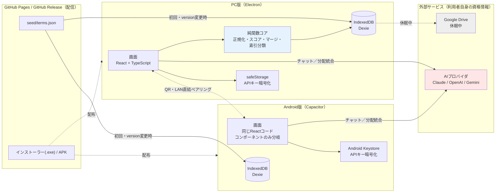
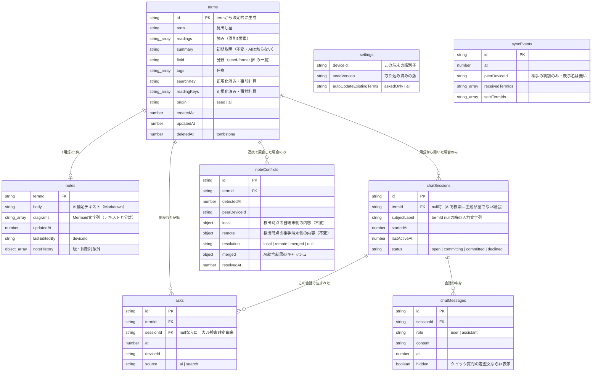
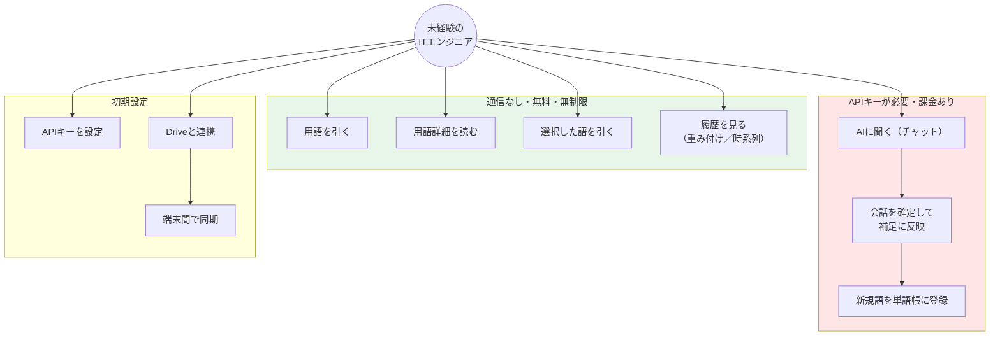
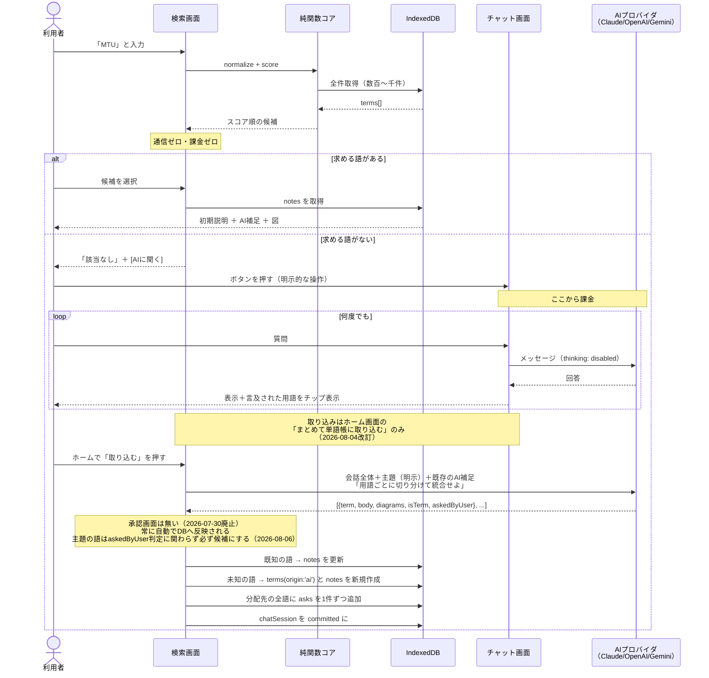
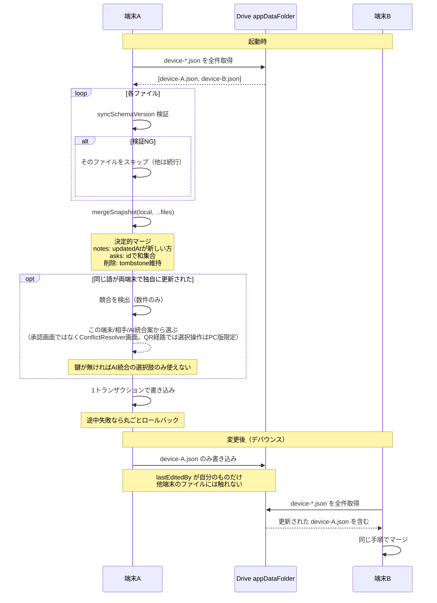
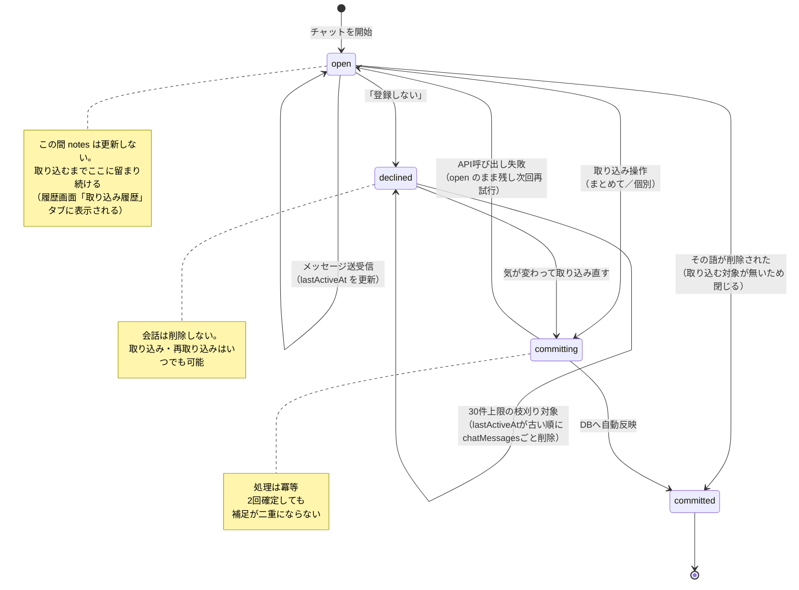
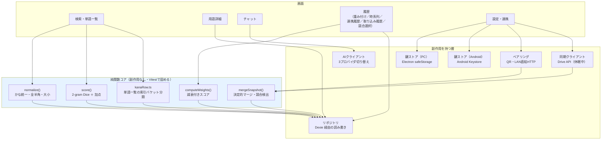
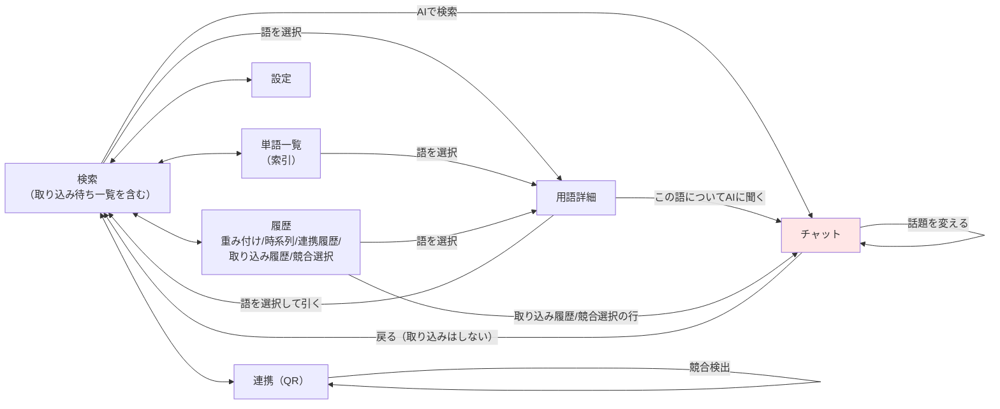

# IT-Index アーキテクチャ

- 版: 1.1（2026-08-07。§1・§2・§4.2・§5・§6・§7・§8を実装に合わせて更新。図の骨格自体は1.0から維持）
- 前提: [要件定義書](./requirements.md) / [初期データ形式仕様](./seed-format.md)

図はすべて Mermaid。GitHub 上でそのまま描画される（アプリ本体でも Mermaid を使うので技術が一貫する）。

---

## 1. 全体構成

**自前のサーバーを持たない。** アプリが直接、利用者自身の資格情報で外部APIを呼ぶ。

**2026-07〜08の方針転換（版1.0からの主な変化）**:
- PC版は**Electronアプリ**として配布する（ブラウザのPWAではない）。Android版は**Capacitor**でネイティブアプリ化。GitHub Pagesでのブラウザ配信も引き続き可能（同じReactコードを`vite build`するだけ）だが、実機配布はGitHub Releaseのインストーラー(.exe)・APKが主
- AIは**Anthropic Claude固定ではなく、Claude/OpenAI/Geminiの3プロバイダを切り替え可能**にした（[ai-client.md §1.5](./ai-client.md)）
- 端末間同期は**Google Driveではなく、QRコードによるLAN直結ペアリングが主手段**になった（[manual-sync.md](./manual-sync.md)）。Drive経由の実装は残っているが休眠中（[drive-sync.md](./drive-sync.md)）



- 🔴 **赤 = 課金・通信が発生する境界。** 検索と閲覧はここを通らない
- 🔵 **青 = 純関数として切り出す部分。** 単体テストで固める対象
- **PC/Android間で直接やり取りするのはQRペアリング（LAN内HTTP）だけ。** サーバーも外部の仲介も無い（[manual-sync.md](./manual-sync.md)）

---

## 2. ER図

**同期対象かどうかが設計の要**なので、色で示す。



`keyStore`（APIキーの暗号化保存）は`terms`等と関連を持たない独立テーブルのため上図には含めない。詳細は[data-layer.md §2.2](./data-layer.md)。

### 同期対象の区分

| テーブル | 同期（QR連携） | 理由 |
|---|---|---|
| `terms` | **しない**（例外あり） | 配信データ由来で全端末同じ。`version` で入れ替えるだけ |
| `notes` | **する** | **端末ごとに育つ唯一のデータ** |
| `asks` | **する** | 追記のみ。`id` で和集合。重み付けの計算元 |
| `chatSessions` / `chatMessages` | **しない** | 共有すべきは統合された結果であって、過程ではない |
| `settings` | **しない** | 端末固有 |
| `keyStore` | **しない** | APIキーの暗号化保存用（明示オプトイン時のみ1行）。PC版はElectron `safeStorage`、Android版はAndroid Keystoreで暗号化するため、他端末にコピーしても復号できない。詳細は [data-layer.md §2.2](./data-layer.md) |
| `syncEvents` / `noteConflicts` | **しない** | 連携そのものの記録・競合解決の作業用データで、端末ローカルの履歴 |

> **例外**: `origin: 'ai'` の語（初期データに無く、チャットから登録された語）は他端末に存在しないため、`terms` も同期対象に含める。削除（tombstone）も`origin`を問わず同期対象（[data-layer.md §2.1](./data-layer.md)相当。`core/syncTarget.ts`）。

**実装状況（2026-08-07）**: `mergeSnapshot()`（決定的マージ）は実装済み。**同期の主手段はQRコードによるLAN直結ペアリング**（`src/pairing/`・`src/manualSync/`。「ファイルでやり取りする」経路・共有フォルダ方式はいずれも廃止済み）。Drive経由の読み書き層（`src/drive/`）も実装済みだが休眠中（[drive-sync.md](./drive-sync.md)）。同じ語を両端末が独自に編集していた場合の競合解決は**PC版に一本化**（[requirements.md §5.5](./requirements.md)）。

### 設計上の要点

| 決定 | 理由 |
|---|---|
| **`summary` と `notes.body` を別テーブルに分ける** | 初期データを更新配信しても**AI補足が上書きされない**。構造で保証する |
| **`diagrams` を `body` と分ける** | Mermaid構文エラーが**テキストを巻き添えにしない**。構造で保証する |
| **`asks` にカウンタを持たず、ログで持つ** | カウンタは同期で壊れる（新しい方を採ると消える／合算すると二重計上）。ログの和集合なら**何度マージしても結果が同じ** |
| **`searchKey` / `readingKeys` を事前計算** | 検索のたびに正規化しない。**後から正規化ルールを変えると全件再計算が必要**なので最初に固める |

---

## 3. ユースケース図



**鍵が無くても緑の枠はすべて動く。** 審査員や初見の利用者が、何も設定せずに辞書として使える。

---

## 4. シーケンス図

### 4.1 検索 → チャット → 確定 → 分配統合

**このアプリの中核の流れ。**



**要点:**

- **検索は一切通信しない。** 課金の入口は `[AIに聞く]` ボタン1つだけ
- **対話中は `notes` を更新しない。** 取り込み時に1回だけ。繰り返し統合による劣化を防ぐ
- **取り込みはホーム画面からの明示的な操作のみ。** 自動では走らない（2026-08-04改訂）
- **`asks` は分配先の語ごとに立つ。** 重み付けの加算元がここ

### 4.2 同期（Drive経由・休眠中の実装）

> **この節はDrive同期（`src/drive/`）の設計であり、現在の主同期経路ではない。** 実際に使われているQRコードによるLAN直結ペアリングの流れは[manual-sync.md](./manual-sync.md)を参照。決定的マージ（`mergeSnapshot()`）自体はQR経路でも同じものを再利用しているため、下図の「マージ」「競合検出」の部分だけは両経路で共通の設計として読める。



**要点:**

- **各ファイルの書き手が1台だけ。** 取り合いが起きないので更新消失が構造的に発生しない
- **1ファイルが壊れても他は読める。** 端末ごとに分けたことの副次効果
- **AI補助は任意。** 鍵が無くても決定的マージだけで同期は完結する

### 同期ファイル（`device-*.json`）の構造

```json
{
  "syncSchemaVersion": 1,
  "deviceId": "...",
  "writtenAt": 1753300000000,
  "notes":  [ /* lastEditedBy が自分のものだけ */ ],
  "asks":   [ /* 自分の端末で発生したものだけ */ ],
  "aiTerms":[ /* origin:'ai' の語だけ。他端末に存在しないため */ ]
}
```

> ⚠️ **`syncSchemaVersion` は、初期データの `schemaVersion`（[seed-format.md](./seed-format.md) §1）とは別物。**
> 前者は同期ファイルの形式、後者は配信データの形式で、**独立して変わる**。実装で共通のバリデータを使い回さないこと。名前を分けてあるのはそのため。

---

## 5. 状態遷移図 — チャットセッション

**2026-07-30改訂**: 承認画面（`approving` 状態）は廃止済み（AI提案は確認なしに自動反映される）。さらに、自動トリガー（別用語のチャットを開いた／15分放置／起動時の放置セッション回収）も廃止し、確定操作は明示的なボタン実行のみにした。

**2026-08-04改訂**: 取り込み（確定）操作を**ホーム画面の「まとめて単語帳に取り込む」1箇所に集約**した。チャット画面の確定ボタンと、一時的に復活させていた起動時の自動確定は廃止した（理由は[requirements.md](./requirements.md) §5.3。要点は、APIキーがセッション限りの保持のため起動直後は必ず未認証で自動確定が必ず失敗すること）。

**2026-08-06追加**: 「登録しない」操作により`declined`状態を追加した。AIには登録を拒否する権限が無い代わりに、利用者が明示的に拒否できるようにするための状態（[requirements.md §5.3](./requirements.md)「登録を拒否する権利は利用者にある」）。会話は削除されない。



---

## 6. コンポーネント構成

**純関数として切り出す部分と、副作用を持つ部分の境界を明確にする。**



### なぜ純関数に切り出すのか

| 関数 | 単体テストで固める内容 |
|---|---|
| `normalize()` | `さーば`／`サーバ`／`ｻｰﾊﾞ` が同一キーに落ちる |
| `score()` | `サーバー`→`サーバ`、`TCP/PI`→`TCP/IP` が上位に来る／`1` で `一意` が上位に来ない |
| `mergeSnapshot()` | **同じスナップショットを2回マージしても結果が変わらない**（冪等性）／壊れたデータで既存を消さない／片方でしか編集していない場合を競合と誤検出しない |
| `computeWeights()` | **マージ順序を入れ替えてもスコアが一致する**（決定性）／たくさん聞いた語がその後聞かれなければ沈む |
| `kanaRow.ts` | 全語がいずれかのバケットに必ず入る（索引から抜け落ちない）／読みが無い語がいても例外にしない |

**これらは実機もAPIキーも要らずに検証できる。** 開発中の手戻りを最小化する要。

---

## 7. 画面遷移

**2026-08-07全面改訂**: 承認画面（`APPROVE`）は2026-07-30に廃止済み。トップナビ5項目（検索/履歴/単語一覧/連携/設定）はすべて対等な画面遷移で、モーダルは無い（`src/App.tsx`の`Screen`判別共用体がそのまま実装）。取り込みは検索画面の「取り込み待ち」一覧・履歴画面「取り込み履歴」タブからのみ行い、チャット画面自体に確定ボタンは無い。



**チャット画面は全画面。** 上部に現在の主題（`SubjectContext`）をチップで固定表示する。「取り込み履歴」タブから取り込み済みの会話を開いた場合は閲覧専用（readOnly）で開く。**用語詳細・履歴からの遷移は「戻る」導線が遷移元を覚えている**（`from`パラメータ。検索/単語一覧/履歴のどこから来たかで「戻る」の宛先が変わる）。

---

## 8. 外部依存の一覧

| 依存 | 用途 | 無いとどうなるか |
|---|---|---|
| AIプロバイダ（Anthropic Claude / OpenAI / Gemini。いずれか1つを利用者が選択） | チャット・分配統合・競合のAI統合 | **AI機能のみ停止。辞書・検索・履歴・単語一覧は動く** |
| LAN（QRペアリング。外部サービスではない） | 端末間同期 | **同期のみ停止。単一端末では完全に動く** |
| Google Drive API | 端末間同期（休眠中の代替経路） | 使っていない。QR連携が使えない環境向けの将来の選択肢として実装のみ残す |
| GitHub Pages / GitHub Release | アプリ本体・初期データ・インストーラー/APKの配信 | 起動できない（配信元） |
| mermaid.js | 図の描画 | **図のみ表示不可。テキストは表示される**（別フィールドのため） |

**AI・Drive・LANのいずれも「無くても本体が動く」位置づけ。** 単一障害点にしない。

---

## 関連文書

- [要件定義書](./requirements.md) — なぜこの設計なのか
- [初期データ形式仕様](./seed-format.md) — `terms` に入るデータの形
