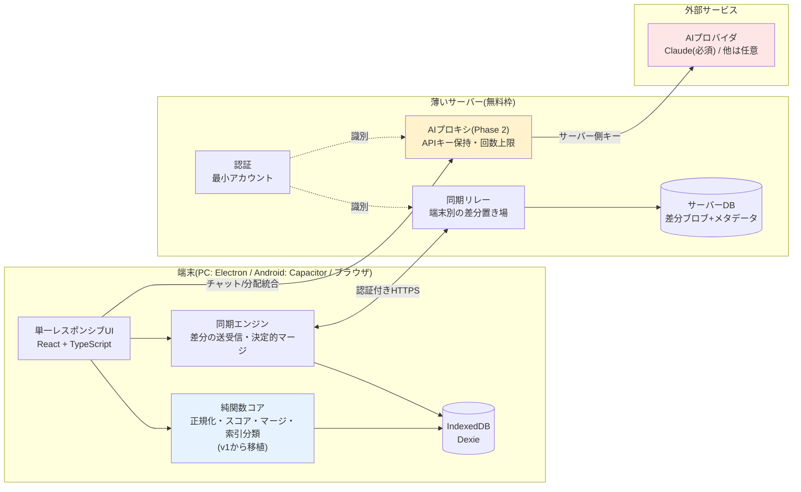
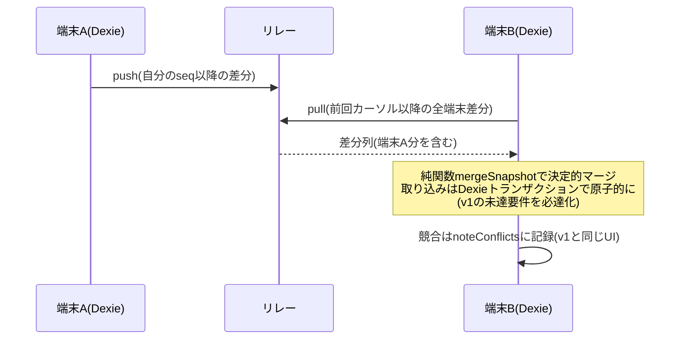

# IT-Index v2 アーキテクチャ — ハイブリッド構成

- 版: 0.1(2026-08-09。初版・レビュー前)
- 前提: [v2 要件定義書](./requirements.md) / 移植元: [v1 アーキテクチャ](../architecture.md)

図はすべて Mermaid(v1と同じ方針)。

---

## 1. 全体構成

**データの所有と主機能はローカル。端末間の調整(同期・APIキー)だけを薄いサーバーが担う。**



- 🔴 赤 = 課金・通信が発生する境界。検索と閲覧はここを通らない(v1と同じ)
- 🔵 青 = 純関数として切り出す部分。単体テストで固める対象(v1から移植)
- 🟡 黄 = Phase 2で導入。Phase 1の間、AI呼び出しは暫定的にv1同様の端末直呼び(端末内キー)
- **サーバーが停止しても左側(端末内)は全機能動く。** 同期とAIだけが止まる

## 2. 責任の所在

| 領域 | 責任 | 持たないもの |
|---|---|---|
| 端末(UI) | 入力受付・表示・操作 | ビジネスルールの唯一の実装にはしない(マージは純関数コアへ) |
| 端末(純関数コア) | 正規化・スコア・**決定的マージ**。同期の突き合わせ結果は全端末で同一になる | I/O・状態 |
| 端末(Dexie) | **学習データの一次所有**。整合性(id一意・トランザクション) | — |
| サーバー(リレー) | 端末別差分の**中継と保管**。内容の解釈はしない(マージしない) | データの正本であること。リレーが消えても端末から再構築できる |
| サーバー(認証) | 本人識別。同期グループ=1アカウント | 認可の細分化(ロール等は対象外) |
| サーバー(AIプロキシ) | APIキーの保持・転送・**利用者別回数上限** | 会話内容の長期保存 |

判断基準(目的/変更理由/影響範囲/安全性/データ所有)で特に効く分離:
- **リレーはマージしない。** マージ規則の変更が端末側の純関数1か所で完結し、サーバー再デプロイ不要になる
- **APIキーはサーバーのみ**(セキュリティ境界で分ける)。端末側のkeystore系実装が丸ごと消える

## 3. データモデル

端末側Dexieは**v1のスキーマを概ね引き継ぐ**(terms/notes/asks/chatSessions/chatMessages/settings/noteConflicts。
[v1 architecture.md §2](../architecture.md))。v2での変更:

| 変更 | 内容 | 理由 |
|---|---|---|
| `keyStore` 廃止(Phase 2完了時) | APIキーを端末に置かない | §2 |
| `syncEvents` → `syncState` | ピア単位の履歴から「リレーと最後に同期した位置(カーソル)」へ | リレー一本化でピア概念が消える |
| `terms.createdBy` 追加 | 作成端末/アカウントの記録 | v1の未解決課題([drive-sync.md §課題](../drive-sync.md)): origin:'ai'語の絞り込みができなかった |
| 同期対象の区分 | v1の区分を踏襲(notes/asks/AI起源termsのみ同期。chat・settingsはしない) | 設計ごと引き継ぐ |

サーバー側は最小限:

| テーブル | 内容 |
|---|---|
| `accounts` | id・email・パスワードハッシュ・作成日時 |
| `sync_blobs` | account_id・device_id・seq(単調増加)・payload(端末が出した差分。**サーバーは中身を解釈しない**)・created_at |
| `usage`(Phase 2) | account_id・期間・AI呼び出し回数(上限判定用) |

## 4. 同期プロトコル

v1の決定的マージ(asksはidの和集合、notesはLWW+競合記録、termsはtombstone)を
**そのまま端末側マージ規則として使い**、輸送だけをリレーに置き換える。



- **冪等**: 同じ差分を2回取り込んでも結果が変わらない(v1のマージ設計が既にこの性質を持つ)
- **原子性**: pull結果の反映は関係テーブルを1トランザクションで書く。途中失敗はロールバックし、カーソルを進めない
- **壊れたデータ**: 検証に通らない差分は取り込みを中止して既存データを保持(v1のシード取り込みと同じ原則)

## 5. AIプロキシ(Phase 2)

- 端末は「認証トークン+会話ペイロード」をサーバーへ送り、サーバーが自分のAPIキーでAIプロバイダを呼んで応答を中継する
- **利用者別の回数上限を必ず入れる**(未設定のままPhase 2を完了にしない)。上限到達時はエラーを日本語で表示(v1のエラー翻訳方針を踏襲)
- 会話内容はサーバーに長期保存しない(転送のみ)。履歴は端末のDexieが持つ(v1と同じ)
- チャット履歴の毎ターン全量送信(v1未解決課題)は、プロキシ側でターン数・トークン量の上限を設けて抑える
- プロンプトインジェクション前提の境界: プロキシは「信頼できない入力(会話)の処理」と「外部への状態変更(AI呼び出し)」を持つが、**他アカウントのデータ・サーバー管理機能へのアクセスは持たせない**

### 2つのキー経路(2026-08-11追加。同日、プロバイダ選択と接続テストを追記)

上流を呼ぶAPIキーには2つの経路があり、**どちらを使うかはリクエスト1件ごとに決まる**。

| 経路 | 既定 | キーの所在 | プロバイダ | 回数上限 | 費用 |
|---|---|---|---|---|---|
| **サーバー側キー** | ○(何も設定しなければこちら) | サーバー(Workers Secret) | `AI_PROVIDER`(運営者が決める) | **あり**(利用者別・全体の日次上限) | 運営者負担 |
| **利用者キー(BYOK)** | — | **利用者の端末のみ**(localStorage) | **利用者が選ぶ**(OpenAI / Anthropic) | **なし**(上限判定もカウントも行わない) | 利用者負担 |

- 判定は単一の条件に閉じる: `POST /api/ai/chat` のボディに有効な `apiKey` が付いていれば利用者キー経路、無ければサーバー側キー経路。
  **上限をスキップする条件と、上流呼び出しに利用者キーを使う条件は同一**にしてあり、サーバー側キーが使われる経路では必ず上限が効く(上限だけ回避することはできない)
- 利用者キー経路では `apiProvider`(`openai` / `anthropic`、未指定なら `openai`)で呼び先が決まり、**`AI_PROVIDER` を見ない**。
  サーバーがOpenAI運用でも利用者はAnthropicのキーを持ち込める(逆も同じ)。
  `apiKey` が付いたリクエストがサーバー側キーへ落ちる経路が無いことが、上記の不変条件をそのまま保っている
- `apiProvider` と `model` は**利用者キー経路でのみ有効**。`apiKey` の無いリクエストに付いていても検証だけして捨てる
  (サーバー側キーの費用を利用者がモデル選択で決められないようにするため)
- モデル名の既定: `AI_MODEL` は「運用中のプロバイダのモデルID」なので、**呼び先が `AI_PROVIDER` と一致する時だけ**使う。
  一致しない場合はそのプロバイダのコード既定(openai: `gpt-5.6-luna` / anthropic: `claude-sonnet-5`)に落とす
- **利用者キーは保存も記録もしない。** D1へ書かず、ログ・エラーメッセージ・レスポンスにも載せない。
  サーバー内での寿命は1リクエスト分で、用途は上流への `Authorization` / `x-api-key` ヘッダのみ(会話内容と同じ「転送のみ」の扱い)
- 利用者キーが上流で拒否された場合(401/403)は、サーバー設定の問題(`ai_config_error`)と混同させないため
  専用コード `user_api_key_invalid` で返し、利用者を設定画面へ誘導する。モデル名が通らない場合は `user_model_invalid`
- 端末側の平文localStorage保存は、v1の端末内暗号化(WebAuthn PRF / keystore)を再現しない判断
  (§1の断念の経緯)。代わりに§6第1層——**利用者自身の支出上限(Monthly budget)設定をUIで必須案内**——で被害を有限化する
- `GET /api/ai/quota` はサーバー側キーの残量のみを表す。利用者キー利用時は意味を持たないため
  クライアントは呼ばず、「自分のAPIキーを使用中(プロバイダ名・回数上限なし)」に表示を切り替える

#### 接続テスト `POST /api/ai/test`(要認証)

**動作保証はしないが、接続テストが通ったキーなら使える**という建て付けにするための入口(v1要件定義書§5.7
「APIキーの設定支援」の再現)。ボディは `{apiKey, apiProvider, model?}`。

- 上流へ**最小のリクエスト1件**(user1件の短文・生成量16トークン)を利用者キーで投げ、成功なら
  `200 {"ok":true,"provider","model","usage"}` を返す。失敗理由は日本語messageで区別する
  (`user_api_key_invalid` / `user_model_invalid` / `ai_upstream_rate_limited` / `upstream_unreachable`)。**キーの値は応答にもログにも載せない**
- **チャットの回数上限(`ai_usage` のアカウント行・全体行)は消費しない**(利用者キーのテストであり費用は本人負担)。
  一方で認証済みアカウントを踏み台に上流を叩かれないよう、`ai_usage` の予約キー `test:<accountId>` の行で
  **テスト専用の日次上限**(`AI_TEST_DAILY_LIMIT`、既定20)を数える。テーブルは増やしていない
- クライアントは**このテストに成功した時だけ**キーを端末へ保存する(未検証のキーはチャットに使わない)。
  保存する情報はキー+プロバイダ+モデル名(任意)+検証済みフラグ。チャットで `user_api_key_invalid` が返ったら
  検証済みフラグを外し、共有キー経路へ戻して設定画面へ誘導する
- **OpenAI以外のプロバイダは実動作の確認をしていない**(接続テストが通れば利用できるが応答品質は保証しない)ことを設定画面に明記する

## 6. セキュリティ

v1 §5.6「漏れても被害が有限」の思想を維持し、境界をサーバーへ移す。

| 層 | v2での内容 |
|---|---|
| 支出上限 | サーバー側キーに支出上限を設定(v1の第1層をサーバーへ移設)+利用者別回数上限(§5)。利用者キー(BYOK)では利用者自身の支出上限設定をUIで必須案内する |
| キーの所在 | 既定はサーバーのみ。同期経路・リポジトリには置かない。**例外は利用者が自分で持ち込むキー(§5「2つのキー経路」)で、これは当人の端末のlocalStorageにのみ置き、サーバーには保存しない** |
| 通信 | 端末⇔サーバーはHTTPS+認証必須 |
| XSS | v1の第4層を踏襲(CSP厳格化・innerHTML不使用・AI出力サニタイズ)。**依然としてここが本丸** |
| サーバー上のデータ | 同期ブロブの暗号化(端末側で暗号化してから預ける方式)を優先検討。少なくとも平文の学習履歴を無期限保存しない |

## 7. サーバー基盤の選定基準と選定結果

**選定結果(2026-08-09確定): Cloudflare Workers + D1。**
公式ドキュメントで確認した根拠: 停止・休止条件が存在しない(Supabaseは非アクティブ1週間で停止)/
無料枠(API 10万件/日・D1書込10万行/日・5GB)超過時は課金でなくエラー/静的アセット配信は無料・無制限/
fetch待ちはCPU時間(10ms)に数えず実行時間無制限のためAIプロキシの応答待ちが成立。
未確認: アカウント作成時のクレジットカード要否(作成時に確認)。無料プランにSLAは無い。

当時の候補と基準(記録として残す):

1. **無料枠が常設か**(期間限定トライアルは不可)
2. リクエスト数・DB容量の無料枠が本用途(個人・数端末・低頻度同期)を余裕で満たすか
3. TypeScriptで書けるか(端末側と言語を揃え、マージ規則等の型を共有する)
4. クレジットカード登録なしで始められるか(v1の「$5無料クレジット」方針と同系)
5. スリープからの復帰遅延が同期用途で許容範囲か

## 8. リポジトリ構成と段階移植

旧実装は削除せず共存させ、段階的に置き換える:

```
it-index/
  src/          … v1実装(凍結。バグ修正のみ)
  v2/
    client/     … 新クライアント(React+TS+Dexie、単一レスポンシブUI)
    server/     … 同期リレー+認証(+Phase 2でAIプロキシ)
    shared/     … 端末・サーバー間で共有する型・純関数(マージ規則・検証)
  docs/v2/      … 本書ほか
```

- **v1の`src/core/`(純関数)とマージ規則は最初に`v2/shared/`へ移植**し、v1の単体テストごと持ってくる
- `App.tsx`への責務集中は再現しない: 画面遷移(ルーター)・同期エンジン・確定オーケストレーション・テーマを最初からモジュール分離する
- ビルド生成物(release/等)は最初から.gitignoreに入れる

### 段階計画

| Phase | 内容 | 完了条件 |
|---|---|---|
| 0 | CI整備(v2ワークスペースの型検査・lint・単体テスト・E2Eゲート) | 最初のコミットからCIが緑/赤を判定する |
| 1 | コア移植+単一UI+リレー同期+最小アカウント+v1データ移行 | v1の主機能(検索・詳細・チャット・重み付け)が動き、2端末同期がリレー経由で成立。移行手順が文書化されテスト済み |
| 2 | AIプロキシ(サーバー側キー+回数上限)、端末内キー保管の廃止 | 端末にAPIキーが存在しない状態で全AI機能が動く |
| 3 | 旧実装(src/・pairing/・drive/等)の削除 | v2が全端末で運用され、v1に戻る理由が無くなった後 |

## 9. テスト・CI

- **単体**: 純関数コア(移植分はv1のテストを流用)+同期マージ・検証(v2/shared/)
- **サーバー**: リレーAPIの結合テスト(認証・seq採番・冪等性)
- **E2E**: 主要フロー(検索→チャット→確定→重み付け、2端末同期)。investigate系の使い捨てスペックは持ち込まない
- **CI**: PR時に型検査・lint・単体・E2Eを実行。既存のv1向けCI([.github/workflows/](../../.github/workflows/))にv2ジョブを追加する形で開始

## 関連文書

- [v2 要件定義書](./requirements.md)
- [v1 アーキテクチャ](../architecture.md) — 移植元のER図・シーケンス図・状態遷移図
- [v1 ai-client.md](../ai-client.md) — AI契約・プロンプト設計(Phase 2で流用)
