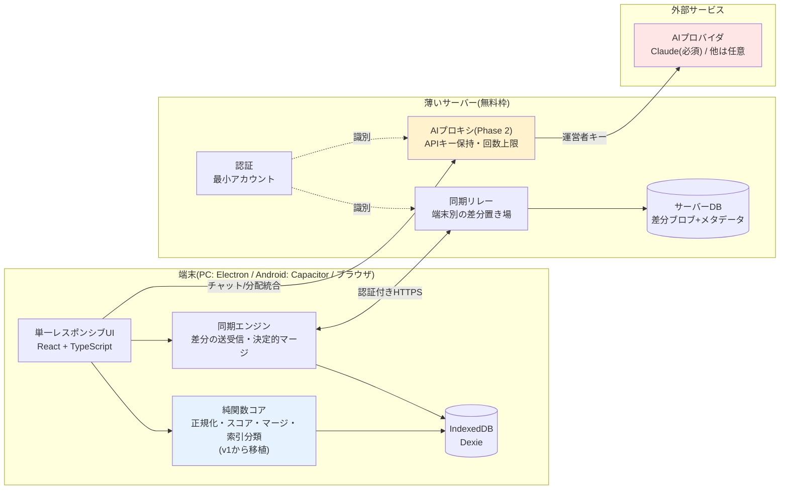

# IT-Index v2 アーキテクチャ — ハイブリッド構成

- 版: 0.1(2026-08-09。初版・レビュー前)
- 前提: [v2 要件定義書](./requirements.md) / 移植元: [v1 アーキテクチャ](../architecture.md)

図はすべて Mermaid(v1と同じ方針)。

---

## 1. 全体構成

**データの所有と主機能はローカル。端末間の調整(同期・APIキー)だけを薄いサーバーが担う。**



- 🔴 赤 = 課金・通信が発生する境界。検索と閲覧はここを通らない(v1と同じ)
- 🔵 青 = 純関数として切り出す部分。単体テストで固める対象(v1から移植)
- 🟡 黄 = Phase 2で導入。Phase 1の間、AI呼び出しは暫定的にv1同様の端末直呼び(端末内キー)
- **サーバーが停止しても左側(端末内)は全機能動く。** 同期とAIだけが止まる

## 2. 責任の所在

| 領域 | 責任 | 持たないもの |
|---|---|---|
| 端末(UI) | 入力受付・表示・操作 | ビジネスルールの唯一の実装にはしない(マージは純関数コアへ) |
| 端末(純関数コア) | 正規化・スコア・**決定的マージ**。同期の突き合わせ結果は全端末で同一になる | I/O・状態 |
| 端末(Dexie) | **学習データの一次所有**。整合性(id一意・トランザクション) | — |
| サーバー(リレー) | 端末別差分の**中継と保管**。内容の解釈はしない(マージしない) | データの正本であること。リレーが消えても端末から再構築できる |
| サーバー(認証) | 本人識別。同期グループ=1アカウント | 認可の細分化(ロール等は対象外) |
| サーバー(AIプロキシ) | APIキーの保持・転送・**利用者別回数上限** | 会話内容の長期保存 |

判断基準(目的/変更理由/影響範囲/安全性/データ所有)で特に効く分離:
- **リレーはマージしない。** マージ規則の変更が端末側の純関数1か所で完結し、サーバー再デプロイ不要になる
- **APIキーはサーバーのみ**(セキュリティ境界で分ける)。端末側のkeystore系実装が丸ごと消える

## 3. データモデル

端末側Dexieは**v1のスキーマを概ね引き継ぐ**(terms/notes/asks/chatSessions/chatMessages/settings/noteConflicts。
[v1 architecture.md §2](../architecture.md))。v2での変更:

| 変更 | 内容 | 理由 |
|---|---|---|
| `keyStore` 廃止(Phase 2完了時) | APIキーを端末に置かない | §2 |
| `syncEvents` → `syncState` | ピア単位の履歴から「リレーと最後に同期した位置(カーソル)」へ | リレー一本化でピア概念が消える |
| `syncEvents` 再導入(#157) | 同期実行1回=1レコードのログ(v1と違いピア単位ではなく実行単位)。競合が`noteConflicts.syncEventId`でリンクし、履歴タブの「連携履歴」「競合」から追跡できる | 競合の発生元の同期を辿れるようにする(v1は両者に参照関係が無く突合できなかった) |
| `terms.createdBy` 追加 | 作成端末/アカウントの記録 | v1の未解決課題([drive-sync.md §課題](../drive-sync.md)): origin:'ai'語の絞り込みができなかった |
| 同期対象の区分 | v1の区分を踏襲(notes/asks/AI起源termsのみ同期。chat・settingsはしない) | 設計ごと引き継ぐ |

サーバー側は最小限:

| テーブル | 内容 |
|---|---|
| `accounts` | id・email・パスワードハッシュ・作成日時 |
| `sync_blobs` | account_id・device_id・seq(単調増加)・payload(端末が出した差分。**サーバーは中身を解釈しない**)・created_at。**端末ごとに最新1行だけ残す**(#202。下記) |
| `usage`(Phase 2) | account_id・期間・AI呼び出し回数(上限判定用) |
| `licenses` | code(UNIQUE)・account_id・source(`'purchase'`\|`'operator'`)・issued_at・activated_at・canceled_at |
| `payment_methods` | account_id(PK)・brand・last4・expiry・holder_name・updated_at。**表示用のみ。カード番号とCVCの列は無い** |

`licenses`は**発行(issue)と有効化(activate)を分離する**設計にする。コード発行時点では`account_id`と
`activated_at`は空で、決済モック([requirements.md §4.2](./requirements.md))の「発行」を表現する。利用者がコードを入力した時点で
`account_id`・`activated_at`を埋める。`source`は`'purchase'`(決済経由で発行)と`'operator'`(運営者が手動発行。
検証・優待用)を区別する。**`accounts`テーブルの列(例: `has_license` bool)ではなく別テーブルにする**のは、
発行済みだが未使用のコード(在庫)を表現する必要があり、かつ1コード=1回の有効化に限定する検証(`code`のUNIQUE制約
+`activated_at`の有無チェック)をシンプルにするため。**このテーブルは公式ホスト運用時のみ意味を持つ**
(セルフホストでは`LICENSE_ENABLED='0'`でライセンス確認自体を無効化できる。[deploy.md「運用ノート」](./deploy.md))。

解約([requirements.md §4.3](./requirements.md))は行を削除せず`canceled_at`を立てる。`code`のPRIMARY KEYを
保ったまま「解約済み」を記録に残すことで、解約したコードでの再有効化を弾ける(再開は新規購入)。
ゲートの判定は`hasActiveLicense`(`activated_at IS NOT NULL AND canceled_at IS NULL`)の1箇所に集約し、
表示だけ解約済みで実権限が残る状態を作らない。

`payment_methods`は設定タブに「どのカードから引き落とされているか」を表示するためだけのテーブル。
当初は端末のlocalStorageに置いていたが、ライセンスがアカウント単位である以上、購入した端末以外で
矛盾表示になるため、アカウントに属するデータとしてここへ移した(1アカウント1枚。カード変更はUPSERT)。
**完全なカード番号とCVCは列として存在せず**、受け取る経路も無い。解約時は行ごと削除する。

## 4. 同期プロトコル

v1の決定的マージ(asksはidの和集合、notesはLWW+競合記録、termsはtombstone)を
**そのまま端末側マージ規則として使い**、輸送だけをリレーに置き換える。


### 端末ごとに最新1行だけ残す(#202)

`sync_blobs` は当初 `INSERT` するだけで行が消えず、自動push(取り込み完了・競合解消・起動時・
オンライン復帰。#177/#179/#193)のたびに積み上がっていた。カーソルが0に戻った端末
(ローカル削除・鍵の受け取り)はその全部を取り直すため、**受信件数が実態とかけ離れて膨らむ**。

各payloadは**端末の全量スナップショット**なので、端末ごとに最新1件あれば足り、古い行は
新しい行に完全に含まれている。そのため push 時に同じ `device_id` の古い行を消す。

- **中身は解釈しない。** 見るのは `device_id` と `seq` だけで、§2の責任分担は変わらない
- **`latest` は減らない。** 消すのは「今入れた行より古い同一端末の行」だけなので、
  最大seqは常に直前の挿入行。クライアントのカーソル自己修復(`latest < cursor` で0へ戻す)を
  誤発火させない
- 消し残っても壊れない。次のpushでまた消しにいくだけで、マージは冪等なので結果は変わらない

**利用者への表示は「受信N件」ではなく「N語 変わりました」にする。** blobの件数は端末が送る
全量スナップショットの数で、中身が同じでも1件と数えるため、利用者にとって意味を持たない。
同期の前後のスナップショットを `computeSyncDelta`(shared)で突き合わせて語数を出す。

### 複数台と競合した場合の表示(#203)

競合レコードは**端末ごとに1件**できる(`findOpenByTermAndPeer` で termId + 相手端末 の組で引く)。
複数の端末で同じ単語にAI検索を掛け続けると、その単語の競合が端末の数だけ並ぶ。
**データ構造は元から複数台に対応しており、足りなかったのは表示のまとめ方**だった。

- 同期タブでは単語ごとにまとめ、**縦一列**で出す(`client/src/screens/ConflictGroupItem.tsx`)。
  従来の横2列(`ConflictItem`)は3台以上で収まらない
- **この端末の内容を一番上に固定する**(位置が毎回変わると見比べにくいため)。
  相手端末は**ノートの更新が新しい順**——選ぶ価値が高いのは内容が新しい端末のため
- 1枚に並べるのは `MAX_CONFLICT_DEVICES`(5台)まで。超えた分は件数だけ知らせ、履歴タブから辿る。
  落とすのも更新が古い側から
- グループ同士は最新の検出が新しい順。**同じ語で再発すればその語が上に来る**ため、
  1つの語の経緯が散らばらない
- **履歴タブは従来どおり1対1の `ConflictItem` を使う。** あちらは「いつ何を選んだか」を
  1件ずつ辿る場所で、まとめると経緯が読めなくなる
- Androidネイティブでは解消操作を出さない方針(#165)は変わらない

- **冪等**: 同じ差分を2回取り込んでも結果が変わらない(v1のマージ設計が既にこの性質を持つ)
- **原子性**: pull結果の反映は関係テーブルを1トランザクションで書く。途中失敗はロールバックし、カーソルを進めない
- **壊れたデータ**: 検証に通らない差分は取り込みを中止して既存データを保持(v1のシード取り込みと同じ原則)
- **ライセンス(2026-08-12追加)**: `POST /api/sync/push`・`GET /api/sync/pull`は、**公式ホストでは有効なライセンスを
  持つアカウントに限り**実行できる(実装済み。ゲートの置き所は§5の不変条件と同じ方針)。セルフホストでは
  ライセンス概念が無いため、同期は無条件で動く([requirements.md §4](./requirements.md))

### 鍵の受け渡しは同期の前提条件(#226)

`syncEngine` が鍵を**自動生成**していたため、受け渡しを一度もしていない端末でも同期でき、
**鍵の受け渡しという仕組みそのものが迂回できた**。相手からは復号できない差分が並ぶ。

元の設計は「最初にpushする端末が鍵を作る。2台目は復号できない差分が届くことで気づき、
そこで受け渡しへ誘導する」——受け渡しを**事前の必須手順ではなく事後の是正**として置いていた。
これを改める。

#### ゲートは同期エンジンに置く

**画面のボタンだけ塞いでも漏れる。** 鍵の取得は起動時の自動pull(#193)も通る経路で、
アプリを起動した時点で鍵が作られてしまう。

- `syncEngine` は `getDataKey`(作らない)を使い、無ければ `SyncKeyMissingError` を投げる
- `autoPull` はそれを `skipped('no-key')` として静かに終える(起動時に画面へ割り込まない)
- `SyncScreen` は「今すぐ同期」を押せなくし、**作る/受け取るの2択**を出す

#### 鍵を作れるのは明示的な操作からだけ

`getOrCreateDataKey` の呼び出し元は3つに限る——QRの表示・数字コードでの受け渡し・
「この端末で新しく鍵を作る」。**いずれも利用者の明示的な操作が起点。**
1台目は作る、2台目以降は受け取る——どちらを選ぶかで結果が大きく変わるため、暗黙に作らない。

#### 鍵の有無は state に写す(描画中にlocalStorageを読まない)

localStorageが正本だが、**描画中に読むと React Compiler が不純と判定し、
このコンポーネントの最適化を丸ごと諦める**(既存の `useCallback` のメモ化が保てなくなり
lintがエラーになる)。実装中に実測して分かった。そのため state へ写し、
accountId の確定と鍵の作成・受け取りで追随させる。

代償として **accountId が確定した直後の1描画だけ「鍵が無い」側で描かれる**。
見た目には同期ボタンが一瞬押せないだけで、押せない間に押せてはいけない操作は無い。
テストは「押せるようになるまで待ってから押す」形にしてある(実際の利用者の操作と同じ)。

#### 「今すぐ同期」は画面に1つ

鍵を受け取った直後の誘導ボタンが、画面上部のボタンと重複していた。案内の文言は残して削除した。

### 競合の表示は1つのコンポーネントに統一する(#225)

**同じ競合が画面によって別物に見えてはいけない。** 統一前は1つのアプリに3通りの表示があった。

| | 同期画面(未解決) | 同期画面(解決済み) | 履歴タブ |
|---|---|---|---|
| 旧 | `ConflictGroupItem`(単語ごと・縦一列) | `ConflictItem`(横2列) | `ConflictItem`(同期イベントごと) |
| 新 | `ConflictGroupItem` | `ConflictGroupItem` | `ConflictGroupItem` |

`ConflictItem` は廃止した。共通文言(`CONFLICT_PC_ONLY_NOTICE`)と決着理由の文言は
`ConflictGroupItem` へ移した。

**履歴タブは同期イベントごとの区切りを残す。** 完全に単語ごとへ寄せると「いつ起きたか」の軸が
失われるため、区切りはそのままに、その中身だけを単語ごとのまとまりで描く。

**「この端末の内容」側の操作可否はグループ単位で決まる。** 相手側は競合ごとに決まるが、
こちら側は1つしかない。`peer-decision` しか無いグループでは、こちら側にも採用ボタンを出さない——
出すと相手側だけ操作不可というちぐはぐな状態になる。

#### 画面間のリンク

同期画面に出るのは**直近の同期に紐づく競合**だけで、過去の経緯は履歴タブが正本。
行き来できないと、どちらが全体像なのか利用者から分からない。

- 同期画面 → 履歴タブの競合: 「競合履歴を見る」(Android の案内側にも置く)
- 履歴タブ → 該当競合: 連携履歴の「競合を見る」(#157 で実装済み)

### 統合ボタンは解消済みでも出す / プロンプトは用途ごとに分ける(#246)

#### 採用しても統合できる

#238で統合をグループ単位にした際、表示条件を「未解決の競合があるとき」に狭めたため、
**どれかを採用した瞬間にボタンが消えていた**（実機で報告）。競合履歴に出るのは決着済みが
中心なので、履歴タブではほぼ常に出なかった。

対象を「解消できる競合」全部へ広げる（`closedReason === 'peer-decision'` だけ対象外。
解消をPC側へ集約する #157/#165 の設計は維持）。押した時の挙動:

- **統合結果のキャッシュがあり、いまそれを採用していない** → キャッシュを適用（AIを呼ばない）
- **それ以外**（未解決がある / 既に統合済みで押し直した） → **AIを呼んで作り直す**

「既に統合済みで押し直した」時にキャッシュを再適用しても何も変わらないため、
やり直しとして新しく統合する方が押した人の意図に合う。

#### システムプロンプトは用途ごとに分ける

`MERGE_SYSTEM_PROMPT` は**AI確定(分配統合。`ai/distribution.ts`)でも使われている**。
#238 でこれを「複数の端末それぞれの説明」へ書き換えたため、**AI確定の文脈(既存の説明＋
新しい説明の2版)と食い違わせてしまった**。

端末統合用は `UNIFIED_MERGE_SYSTEM_PROMPT` として分けた。
**前提が違うものを1つのプロンプトで兼ねると、片方を直した時にもう片方が壊れる。**

### 「採用中」はグループに1つだけ(#242)

**競合レコードは相手端末ごとに1件ずつある(#224)が、ノートは1語に1つしか無い。**
採用中の判定をレコードごとにしていたため、別々の解消結果が入っていると
「AIで統合した内容」と「別の端末の内容」の**両方に採用中が付き**、いまノートに入っているのが
どれか画面から判断できなかった（実機で報告された）。

**最後に解消したものが、いまの内容。** `resolvedAt` が最大のレコードを「いまの選択」とし、
バッジ・「現在の選択」の行・AI統合の結果表示を、いずれも**グループに1回だけ**出す。

統合結果は全レコード共通なので、レコードごとに出すと同じ内容が並ぶ点も併せて直した。

### AI統合は全端末を1回でまとめる(#238)

**相手端末ごとに統合してはいけない。** 実機で報告された症状（PC + Android 2台で両方を統合）:

- どちらも「✓ 採用中」になったのに、**Androidの競合が解消されない**
- PC上は解消済みに見える

#### なぜ壊れるか

相手ごとに統合すると、PCの操作は次のようになる。

1. A1と統合 → ノート = `merge(PC, A1)`
2. A2と統合 → ノート = `merge(merge(PC,A1), A2)`

**(1) 「採用中」の中身が食い違う。** 手順1と手順2で確定した内容は別物なのに、
カードにはどちらも「採用中」と出る。手順1の結果は画面のどこにも残らない。

**(2) 決定が分裂して相手が収束しない。** Androidには解消UIが無く、PCの決定を受け取ることでしか
収束しない。2回統合すると**PCが2回に分けて別々の決定をpushする**ため、Androidから見ると
「決定が来た → また別の決定が来た」となり、その間にAndroid自身が編集していれば再び競合が立つ。

**(3) AIが拾った情報が落ちる。** 1回目の統合結果を2回目でもう一度AIに通すため、
**A1の情報は要約の要約になる**。台数が増えるほど薄まる。

#### 変更後

**1回のAI処理で、この端末＋相手全部を統一する。**

- プロンプトはN版対応（`buildUnifiedMergeMessages`）。「この端末の説明」＋「別の端末1..n の説明」を並べる
- ボタンは**グループに1つ**。相手ごとの統合ボタンは廃止した
  （残すと、分けて統合した時に同じ不整合が再発する）
- 結果を**そのグループの競合レコード全件**に `resolution='merged'` として記録し、ノートは1回だけ更新する
- ノートには #234 の `resolvedAt` が立つので、**相手は1つの決定として受け取る**

#### 決めたこと

- **表示上の上限(5台)で畳まれた分も含め、全件をAIへ渡す。** 情報を落とさない方針に沿う
- **失敗したら何も適用しない。** 全部成功か、何もしないか。中途半端に一部だけ解消されると
  変更前と同じ不整合になる
- **統合結果のキャッシュは残す。** 選び直し（一度「この端末の内容」にしてから統合へ戻す）のたびに
  課金するのは筋が悪い。ただし**対象全件が同じキャッシュを持つ時だけ**使う——1件でも欠けていれば、
  その相手の情報が入っていない古い結果なので作り直す

### 競合の解消をして初めて、その内容が他の端末でも共有される(#234)

**競合中は、どの端末も自分の版を保持する。** 相手の内容を採るのは、それが**解消の結果**の時だけ。

以前はPC側だけ newest-wins で内容を確定していたため、**利用者が何もしていないのに自分の書いた
本文が相手の版へ置き換わっていた**。実測で確認した結果(A="Aが書いた本文" / B="Bが書いた本文"、
Bの方が新しい状態でAが同期):

| | 変更前(PC) | 変更前(Android) | 変更後(共通) |
|---|---|---|---|
| この端末のノート | **相手の版** | 自分の版 | 自分の版 |
| noteHistory | **空**(自分の版が残らない) | 空 | 空 |

自分の版は競合レコードのスナップショットにしか残らず、通常の履歴からは戻せなかった。
単語詳細画面と競合カードが「この端末の内容」について違うことを言う状態でもあった。

#### 「解消の結果」を同期データで見分ける

以前は「相手の版が競合検出時より新しければ相手の決定とみなす」という**推定**で、
解消と単なる追加編集を区別できなかった(#157も「PCが解消せず単に追加編集した場合も
決定扱いになるが、PC権威モデルとして許容する」と認めていた)。方針を満たすには推定では足りない。

`NoteRecord.resolvedAt` を足し、**`applyConflictResolution` だけがこれを立てる**。
手入力の保存(`saveBody`)・AI確定(`applyCommit`)は `null`。**同期対象**で、相手はこれを見て採否を決める。

`syncSchemaVersion` は上げない。`validateSyncFile` は未知のフィールドを拒否しないため追加は素通りする。

#### 採用の条件

相手の版を採るのは次を**すべて**満たす時だけ。

1. `resolvedAt` がある = 解消の結果である
2. こちらの版より新しい = 既に反映済みでも巻き戻しでもない
3. 競合を記録済みなら、その時に見た版より新しい(baseline)

**探す範囲は「競合相手」ではなく、その語のremote全体。** 限定すると取りこぼす——相手が解消した
内容がこちらの過去版と一致していると `isRealConflict` が false になって競合相手の一覧から外れ、
他端末とはまだ競合しているので保持の分岐に入り、**相手の決定が捨てられる**。
5端末の繰り返しシナリオで実際に踏んだ。

**baselineが無い場合も採用する。** 通さないと「まだ一度も競合を見ていない端末に解消結果が
永久に届かない」——実ブラウザのE2Eで踏んだ。

#### 端末による分岐をやめた

`holdLocalOnConflict`(Android=保持 / PC=newest-wins)は廃止した。全端末が同じ規則で動く。
これに伴い、起動時の自動pullがプラットフォーム判定を待つ必要も無くなった(#217の `platformSettled` は
渡す値が無くなったため役目を終えたが、`isNativeApp` は画面の出し分け(#165)で引き続き使う)。

### 競合は端末ごとに記録し、閉じるのは差が無くなった時だけ(#224)

3端末での実機確認で2つの欠陥が出た。**どちらも2端末では露見しない。**

#### 競合の記録は「相手ごと」

`mergeSnapshot` は競合相手を**最も新しい1台だけ**選んでいた。3台で編集しても競合レコードが
1件しかできず、画面は「この端末＋相手1台」の2行しか描けない。#203 は表示のまとめ方を直したが、
**まとめる材料が1件しか無かった**。

**「どの内容が勝つか」と「誰と食い違っているか」を分ける。** notes は1語1件なので勝者は1つのまま
(newest-wins / PC決定の判定も従来どおり)。`conflicts` だけを競合している相手ごとに積む。
同じ端末の版が1回のpullに複数入る場合は、その端末の最も新しい版へ畳む(#169と同じ理由)。

#### 自動クローズは `converged` だけ

照合フェーズは「その語のnoteを受信したか」(termId単位)で競合を `superseded` として閉じていた。
これは**3台以上で別の相手のデータが届いただけで、差の残っている競合まで閉じる**。
実機では「競合履歴を一切触っていないのに解消済みになっている」として現れた。
コード上は「LWW連鎖で内容は収束する」という前提だったが、**収束していない相手が残る。**

判定を**その相手の版を受信し、それがこの端末の現在の内容と一致するか**に変えた(`converged`)。

- 比較対象は保存済みの `remote` スナップショットではなく**今回受信した実物**——
  相手が先に進んでいる場合、古いスナップショットでは判定を誤る
- 相手が同期してこない限り閉じない(差が残っているので、それが正しい)
- `superseded` はもう書き込まないが、**既存の記録が残るため型と表示からは外さない**

#### 自動で閉じた競合も選び直せる

`closedReason` が付いていれば一律で操作不可にしていたが、`converged` は
**利用者が一度も選んでいない**状態で起きうる。それでは選び直す手段が無くなる
(退避した版は競合レコードが保持しているのに使えない)。選び直した内容は次の同期で相手へ伝わるため、
食い違いが残ることはない。

`peer-decision`(AndroidがPCの決定を採用した記録)だけは対象外——
解消をPC側に集約する設計(#157/#165)を崩さないため。

### 起動時の自動pullはプラットフォーム判定を待つ(#217)

起動時の自動pull(#193)は `holdLocalOnConflict` を同期エンジンへ渡す。この値は
「Androidネイティブか」の判定(`isNativeApp`)そのもので、**判定が終わる前に走らせてはいけない。**

`isNativeApp` の初期値 `false` は「PCである」ではなく「**まだ分からない**」を意味する。
判定は `@capacitor/core` の動的import(ビルド出力では独立チャンク。`modulepreload` は付かない)の
解決を待つ一方、`deviceId` はIndexedDBの読み1回で決まる。**どちらが先に確定するかは保証が無い。**

`deviceId` が先に決まると、自動pullの「起動につき1回」ガード(`useRef`)がその時点で立ち、
**Androidでも `holdLocalOnConflict: false` のまま同期が走る。** 依存配列に `isNativeApp` が
あってもガードに阻まれてやり直されず、自己修復しない。

`false` で走った場合の帰結は取り返しがつかない。

- §4の競合方針(#157)が効かず、newest-wins マージになる
- 採用経路が `adoptPeerDecision` ではなく `upsertFromSync` になる。前者は保持していた自版を
  `noteHistory` へ退避してから採用するが、後者は退避しない
- 結果、この端末のノートが**どこにも残らないまま**相手の版に置き換わる。
  Androidには競合解消UIが無い(#165)ため利用者は戻せない

そこで `useAppInit` が判定の完了を `platformSettled` として返し、自動pullはそれを待つ。
**待たせても止まらない**——`detectIsNativeApp()` は読み込みに失敗しても `false` を返して
必ず解決する契約(`lib/platform.ts`)のため、`platformSettled` は必ず true になる。

**検証は実測ではなく順序の再現で行う。** どちらが先に解決するかは端末とストレージの速度で
決まり、実機で測っても「その時は起きなかった」以上のことは言えない。
`App.autoPull.test.tsx` は判定のPromiseをテスト側が握り、`deviceId` 確定後に解決させることで
順序を決定的に再現する(修正前のコードでは落ちることを確認済み)。

## 5. AIプロキシ(3つの経路)

- 端末は「認証トークン+会話ペイロード」をサーバーへ送り、サーバーが自分のAPIキーでAIプロバイダを呼んで応答を中継する
- **利用者別の回数上限を必ず入れる**(未設定のままPhase 2を完了にしない)。上限到達時はエラーを日本語で表示(v1のエラー翻訳方針を踏襲)。
  この上限は運営者キー経路(公式ホスト・セルフホストいずれも)にのみ適用する。BYOKには適用しない(下記)
- 会話内容はサーバーに長期保存しない(転送のみ)。履歴は端末のDexieが持つ(v1と同じ)
- チャット履歴の毎ターン全量送信(v1未解決課題)は、プロキシ側でターン数・トークン量の上限を設けて抑える
- プロンプトインジェクション前提の境界: プロキシは「信頼できない入力(会話)の処理」と「外部への状態変更(AI呼び出し)」を持つが、**他アカウントのデータ・サーバー管理機能へのアクセスは持たせない**

### 3つの経路(2026-08-12改稿: セルフホストの運営者キーを追加。公式ホストの運営者キーにライセンス要件を追加)

上流を呼ぶAPIキーには**3つの経路**があり、どれを使うかは「リクエストに`apiKey`が付いているか」と
「そのサーバーが公式ホストかセルフホストか」で決まる。(b)(c)は技術的には同じコードパス
(運営者がサーバーに設定したキーを使う)で、**運営者が誰か**(公式ホストなら運営チーム、セルフホストなら利用者自身)と
**ライセンス確認の有無**だけが違う。

| 経路 | 既定 | キーの所在 | プロバイダ | ライセンス | 回数上限 | 費用 |
|---|---|---|---|---|---|---|
| (a) **利用者キー(BYOK)** | — | 利用者の端末のみ(localStorage) | 利用者が選ぶ(OpenAI / Anthropic) | 不要 | **なし**(上限判定もカウントも行わない) | 利用者負担 |
| (b) **運営者キー(公式ホスト)** | ○(公式ホストで何も設定しなければこちら) | サーバー(Workers Secret。運営者=公式ホスト運営チーム) | `AI_PROVIDER`(運営者が決める) | **必要**(2026-08-12追加) | あり(利用者別・全体の日次上限) | 運営者負担 |
| (c) **運営者キー(セルフホスト)** | ○(セルフホストで何も設定しなければこちら) | サーバー(Workers Secret。運営者=そのサーバーを立てた利用者自身) | `AI_PROVIDER`(利用者が自分の`wrangler.jsonc`で決める) | 不要(概念が無い) | あり(同じ機構を使うが値は利用者が自分で調整) | 利用者(自分)負担 |

- 判定は単一の条件に閉じる: `POST /api/ai/chat` のボディに有効な `apiKey` が付いていれば(a)利用者キー経路、
  無ければ(b)/(c)運営者キー経路。**上限をスキップする条件と、上流呼び出しに利用者キーを使う条件は同一**にしてあり、
  運営者キーが使われる経路では必ず上限が効く(上限だけ回避することはできない)。この不変条件は変更しない
- **不変条件(2026-08-12追加): 運営者キーが使われるのは、(b)公式ホストでは有効なライセンスを持つアカウントに限る。**
  (c)セルフホストにはこの制約が無い(運営者=利用者自身のため)。**ゲートの置き場所は`ai.ts`の`resolveCallProvider`ではなく
  `index.ts`のルートハンドラ側にする**(実装済み)。`resolveCallProvider`は「利用者キーが有るか無いか」だけを
  判定する関数であり、そこにライセンス確認(公式ホスト限定の追加条件)を混ぜると、上記の既存不変条件(利用者キーの有無=
  上限スキップの唯一条件)が読みにくくなり崩れやすくなるため分離する。同じ方針で`/api/sync/push`・`/api/sync/pull`の
  ライセンスゲートも`index.ts`側に置く(§4)
- 利用者キー経路では `apiProvider`(`openai` / `anthropic`、未指定なら `openai`)で呼び先が決まり、**`AI_PROVIDER` を見ない**。
  運営者キー経路(公式ホスト・セルフホストいずれも)がOpenAI運用でも利用者はAnthropicのキーを持ち込める(逆も同じ)。
  `apiKey` が付いたリクエストが運営者キーへ落ちる経路が無いことが、上記の不変条件をそのまま保っている
- `apiProvider` と `model` は**利用者キー経路でのみ有効**。`apiKey` の無いリクエストに付いていても検証だけして捨てる
  (運営者キーの費用を利用者がモデル選択で決められないようにするため)
- モデル名の既定: `AI_MODEL` は「運用中のプロバイダのモデルID」なので、**呼び先が `AI_PROVIDER` と一致する時だけ**使う。
  一致しない場合はそのプロバイダのコード既定(openai: `gpt-5.6-luna` / anthropic: `claude-sonnet-5`)に落とす
- **利用者キーは保存も記録もしない。** D1へ書かず、ログ・エラーメッセージ・レスポンスにも載せない。
  サーバー内での寿命は1リクエスト分で、用途は上流への `Authorization` / `x-api-key` ヘッダのみ(会話内容と同じ「転送のみ」の扱い)
- 利用者キーが上流で拒否された場合(401/403)は、サーバー設定の問題(`ai_config_error`)と混同させないため
  専用コード `user_api_key_invalid` で返し、利用者を設定画面へ誘導する。モデル名が通らない場合は `user_model_invalid`
- 端末側の平文localStorage保存は、v1の端末内暗号化(WebAuthn PRF / keystore)を再現しない判断
  (§1の断念の経緯)。代わりに§6第1層——**利用者自身の支出上限(Monthly budget)設定をUIで必須案内**——で被害を有限化する
- `GET /api/ai/quota` は運営者キーの残量のみを表す。利用者キー利用時は意味を持たないため
  クライアントは呼ばず、「自分のAPIキーを使用中(プロバイダ名・回数上限なし)」に表示を切り替える

#### 接続テスト `POST /api/ai/test`(要認証)

**動作保証はしないが、接続テストが通ったキーなら使える**という建て付けにするための入口(v1要件定義書§5.7
「APIキーの設定支援」の再現)。ボディは `{apiKey, apiProvider, model?}`。

- 上流へ**最小のリクエスト1件**(user1件の短文・生成量16トークン)を利用者キーで投げ、成功なら
  `200 {"ok":true,"provider","model","usage"}` を返す。失敗理由は日本語messageで区別する
  (`user_api_key_invalid` / `user_model_invalid` / `ai_upstream_rate_limited` / `upstream_unreachable`)。**キーの値は応答にもログにも載せない**
- **チャットの回数上限(`ai_usage` のアカウント行・全体行)は消費しない**(利用者キーのテストであり費用は本人負担)。
  一方で認証済みアカウントを踏み台に上流を叩かれないよう、`ai_usage` の予約キー `test:<accountId>` の行で
  **テスト専用の日次上限**(`AI_TEST_DAILY_LIMIT`、既定20)を数える。テーブルは増やしていない
- クライアントは**このテストに成功した時だけ**キーを端末へ保存する(未検証のキーはチャットに使わない)。
  保存する情報はキー+プロバイダ+モデル名(任意)+検証済みフラグ。チャットで `user_api_key_invalid` が返ったら
  検証済みフラグを外し、共有キー経路へ戻して設定画面へ誘導する
- **OpenAI以外のプロバイダは実動作の確認をしていない**(接続テストが通れば利用できるが応答品質は保証しない)ことを設定画面に明記する

## 6. セキュリティ

v1 §5.6「漏れても被害が有限」の思想を維持し、境界をサーバーへ移す。

| 層 | v2での内容 |
|---|---|
| 支出上限 | 運営者キーに支出上限を設定(v1の第1層をサーバーへ移設)+利用者別回数上限(§5)。利用者キー(BYOK)では利用者自身の支出上限設定をUIで必須案内する |
| キーの所在 | 既定はサーバーのみ。同期経路・リポジトリには置かない。**例外は利用者が自分で持ち込むキー(§5「3つの経路」)で、これは当人の端末のlocalStorageにのみ置き、サーバーには保存しない** |
| 通信 | 端末⇔サーバーはHTTPS+認証必須 |
| パスワード | 新規登録に要件を課す(#205。§6.2)。**ログインでは検証しない** |
| XSS | v1の第4層を踏襲(CSP厳格化・innerHTML不使用・AI出力サニタイズ)。**依然としてここが本丸** |
| サーバー上のデータ | **同期ブロブは端末側で暗号化してから預ける(実装済み。#182)。** 端末が持つ256bitのデータ鍵(DK)でAES-GCM暗号化するため、`sync_blobs.payload`には暗号文しか入らず、**サーバーは鍵を持たない**。詳細は下記 |

### 6.1 同期データの暗号化と鍵の受け渡し(#182)

暗号化・復号は端末側だけで行う(`client/src/sync/syncCrypto.ts`)。**`shared/` には置かない**——
sharedは端末とサーバーの両方がコンパイルする環境非依存のパッケージで、そもそも
サーバーは暗号処理を一切しない(payloadも包まれた鍵も、中身を解釈せず文字列として保管するだけ)。

DKを別の端末へ渡す経路は2つあるが、**対等な選択肢としては提示しない(2段階。本人指定)**。

| 経路 | 提示 | サーバー経由 | 入力 | 位置づけ |
|---|---|---|---|---|
| **QRで渡す** | **既定**(最初から出す) | **通らない** | なし(カメラで読む) | 鍵がサーバーに一切載らないため、覗き見の余地が原理的に無い。代わりに**表示中のQRを第三者に撮られると漏れる**(画面に注意書きを出す) |
| **8桁の数字コード** | 「QRが使えない場合」を開いた時だけ | 通る(5分だけ) | 8桁 | カメラが無い/使えないときの代替。DKをコード由来の鍵(PBKDF2 60万回)で包み、`key_shares`へ預ける。サーバーが受け取るのは**暗号文とsaltだけ** |

**なぜ横並びにしないか。** もともとは数字コードだけの方式で、そこへセキュリティ向上のために
QRを足した経緯がある。両方を並べて出すと利用者が理由なく弱い方を選べてしまい、
**QRを足した意味が無くなる**。そのため数字コードは一段奥へ置き、開いた先で
「鍵が5分間サーバーに置かれること」「QRで渡せるならQRを使うこと」を明示する。

**この線引きは運営側で変更できる。** 実装に固定された仕様ではなく、次の2つのつまみで調整できる
(いずれも1箇所の変更で済む):

| 変えたいこと | 変える場所 | 効果 |
|---|---|---|
| 数字コードの経路自体をやめる | `KeyTransferSection.tsx` の `ALLOW_CODE_FALLBACK` を `false` | QRだけになる。安全側に倒れるが、**カメラの無い端末では鍵を渡せなくなる** |
| 総当たりへの強度を上げる | `syncCrypto.ts` の `TRANSFER_CODE_DIGITS` | 桁数に比例して強くなる。実装は変わらず、入力の手間だけが増える |

数字コード経路の緩和は **TTL 5分 / 取り出し5回まで / 受け取り成功で即削除** の3点。
**守れないのは「包んだ鍵がサーバーに置かれている5分の間にその行を記録された場合」**で、
8桁(10^8通り)は総当たりで開けられる。守れるのは「D1のダンプが後から漏れた」
「運営者が後になって中身を読もうとした」という現実的な脅威のほうで、こちらは行が既に消えている。
強度が要るなら**桁数を増やすのが一番安い**(`TRANSFER_CODE_DIGITS` の1定数で、実装は変わらない)。

**鍵を採用する時点で、サーバー上の古い差分を消す(#182の実機確認で判明)。** 鍵を受け取る側は、
それ以前に「自分で作った鍵」でpushしている場合がある。鍵を上書きするとその差分が
**誰にも復号できない孤児**になり、相手端末はそれに当たると下記の「カーソルを進めない」が働いて
**そこで永久に止まる**——鍵が揃うまで取りこぼさないための安全策が、鍵を揃えた後に自分を縛る形になる。
差分は各端末の全量スナップショットなので、消しても情報は失われない(次のpushで作り直される)。

**受け渡しの成否は、受け取った側にしか出せない。** QRはサーバーを通らず、数字コードも
復号の成否はサーバーに届かないため、**渡した側は相手が読み取れたかを知る手段が無い**。
「完了しました」と書かず、「相手の端末に『鍵を受け取りました』と出れば完了です」と案内する。

同期エンジン側で要るのは次の2点(`client/src/sync/syncEngine.ts`):

- **復号できなかったblobではcursorを進めない。** 「壊れている(=読み飛ばしてよい)」のと違い
  「鍵がまだ揃っていない」だけなので、進めると鍵を受け取った後に取りに行かなくなる。
  件数は`skippedBlobs`と分けて`undecryptableBlobs`で数え、画面から鍵の受け渡しへ誘導する
- **cursorの自己修復。** 鍵の作り直しでサーバー上の差分を全消しすると`seq`が1から振り直しに
  なるため、`latest < cursor`を検出したらcursorを0へ戻す

全端末のDKを失った場合は「鍵を作り直す」(DK再生成 + `DELETE /api/sync/blobs` + 全端末で再push)。
端末内のデータは無事で、失うのは「サーバー経由の同期のやり直し」だけ。取り消せない操作のため、
オールクリア・解約と同じ二段確認にしてある。

平文blobも引き続き読める(`isSyncEnvelope`がfalseなら従来の経路へ落ちる)。移行期間に
サーバー上へ両方が並ぶため、この1分岐だけは残す。

### 6.2 新規登録のパスワード要件(#205)

**このアプリにはパスワード再設定の導線が無い**(メールアドレスは登録するが、それを使った
再設定は実装していない。コンテスト用のため実装コストをかけない判断)。再設定できない以上、
**登録時点で弱いものを作らせない**ことが実質的に唯一の防御になる。
ログインに試行回数の制限も無いため、その分だけここが効く。

| 条件 | 内容 |
|---|---|
| 文字数 | 8文字以上 |
| 文字種 | 英大文字・英小文字・数字をそれぞれ1つ以上 |
| ブロックリスト | よく使われるパスワードは拒否。**大文字小文字を無視した完全一致** |

判定は `shared/src/core/passwordPolicy.ts` の1箇所に置き、**クライアントとサーバーが同じ関数を呼ぶ**。
画面側の検証はUXのための先出しであって防御の本体ではない——`POST /api/auth/signup` を直接叩けば
画面は迂回できるため、**弾いているのはサーバー**。この用途のために `server` から `@it-index/shared` への
依存を足した(それまでは `client` だけが使っていた)。

**検証を効かせるのは新規登録だけで、ログインでは呼ばない。** 再設定できないため、
要件に該当する既存アカウントが永久にログイン不能になる。ブロックリストは
「弱いものを新たに作らせない」仕組みであって、既にあるものを追い出す仕組みではない。
既存アカウントに変更は求めない。

**文字種の条件はNIST SP 800-63Bでは非推奨**(rev.3で`SHOULD NOT`、rev.4で`SHALL NOT`)。
利用者の反応が `Password1` のような予測しやすい型に収束し、攻撃側の解析ルールが
真っ先に探す領域と重なるため。その上で本件は**両方**を入れている:

- **ブロックリストが本命。** NISTが推奨しているのはこちらで、`Password1` のような
  「文字種の条件を満たすが弱い」層を落とせる。文字種チェック単独では防げない層
- **文字種の条件は、この規模では懸念が軽い。** NISTが問題視するのは母集団のエントロピー分布と
  使い回しの誘発で、個人利用・コンテスト用では重みが下がる。`password` / `12345678` のような
  最悪のものを弾く実利がある

未対応(別途): ログインのレート制限、パスワード再設定の導線、
既存ハッシュの再ハッシュとKDFイテレーション回数の見直し(`server/src/crypto.ts` は
PBKDF2-SHA256 10万回で、`syncCrypto.ts` の受け渡しコード側 60万回と揃っていない)。

## 7. サーバー基盤の選定基準と選定結果

**選定結果(2026-08-09確定): Cloudflare Workers + D1。**
公式ドキュメントで確認した根拠: 停止・休止条件が存在しない(Supabaseは非アクティブ1週間で停止)/
無料枠(API 10万件/日・D1書込10万行/日・5GB)超過時は課金でなくエラー/静的アセット配信は無料・無制限/
fetch待ちはCPU時間(10ms)に数えず実行時間無制限のためAIプロキシの応答待ちが成立。
未確認: アカウント作成時のクレジットカード要否(作成時に確認)。無料プランにSLAは無い。

当時の候補と基準(記録として残す):

1. **無料枠が常設か**(期間限定トライアルは不可)
2. リクエスト数・DB容量の無料枠が本用途(個人・数端末・低頻度同期)を余裕で満たすか
3. TypeScriptで書けるか(端末側と言語を揃え、マージ規則等の型を共有する)
4. クレジットカード登録なしで始められるか(v1の「$5無料クレジット」方針と同系)
5. スリープからの復帰遅延が同期用途で許容範囲か

## 8. リポジトリ構成と段階移植

旧実装は削除せず共存させ、段階的に置き換える:

```
it-index/
  src/          … v1実装(凍結。バグ修正のみ)
  v2/
    client/     … 新クライアント(React+TS+Dexie、単一レスポンシブUI)
    server/     … 同期リレー+認証(+Phase 2でAIプロキシ)
    shared/     … 端末・サーバー間で共有する型・純関数(マージ規則・検証)
  docs/v2/      … 本書ほか
```

- **v1の`src/core/`(純関数)とマージ規則は最初に`v2/shared/`へ移植**し、v1の単体テストごと持ってくる
- `App.tsx`への責務集中は再現しない: 画面遷移(ルーター)・同期エンジン・確定オーケストレーション・テーマを最初からモジュール分離する
- ビルド生成物(release/等)は最初から.gitignoreに入れる

### 段階計画

| Phase | 内容 | 完了条件 |
|---|---|---|
| 0 | CI整備(v2ワークスペースの型検査・lint・単体テスト・E2Eゲート) | 最初のコミットからCIが緑/赤を判定する |
| 1 | コア移植+単一UI+リレー同期+最小アカウント+v1データ移行 | v1の主機能(検索・詳細・チャット・重み付け)が動き、2端末同期がリレー経由で成立。移行手順が文書化されテスト済み |
| 2 | AIプロキシ(運営者キー+回数上限)、端末内キー保管の廃止 | 端末にAPIキーが存在しない状態で全AI機能が動く |
| 3 | 旧実装(src/・pairing/・drive/等)の削除 | v2が全端末で運用され、v1に戻る理由が無くなった後 |

## 9. テスト・CI

- **単体**: 純関数コア(移植分はv1のテストを流用)+同期マージ・検証(v2/shared/)
- **サーバー**: リレーAPIの結合テスト(認証・seq採番・冪等性)
- **E2E**: 主要フロー(検索→チャット→確定→重み付け、2端末同期)。investigate系の使い捨てスペックは持ち込まない
- **CI**: PR時に型検査・lint・単体・E2Eを実行。既存のv1向けCI([.github/workflows/](../../.github/workflows/))にv2ジョブを追加する形で開始

### 5端末で競合を繰り返した時の挙動(本人指定の検証)

「1回競合させて期待どおり」では足りない。#157(競合行が積み上がる)・#224(相手ごとに
記録されない)は、いずれも**繰り返した時**に露見した形だった。そこで次を通しで確かめている。

1. 5端末が同じ語を別内容にして競合させる
2. 競合が残ったまま、**複数端末が**同じ語をまた別内容にする
3. 解消する
4. 解消後に、**複数端末が**また競合を起こす

ロジック層は `integration/conflictRounds.integration.test.ts`(実サーバー相手)、
画面は `e2e/conflict.spec.ts`(実ブラウザ5コンテキスト)で見る。

#### 確かめた結果

- 再競合しても**open行は増えない**(相手ごとに1件へ正規化。#157)。スナップショットだけ更新される
- 解消後の再競合は**新しい行**として立ち、決着済みの行は履歴として残る
- 相手が上限(5台)を超えても**記録は落とさない**。表示だけが `hiddenCount` で畳む
- 受け取り直しで解消済みが蒸し返らない

#### この検証で分かったこと

**「この端末の内容」の採用ボタンは、1回押しても競合1件しか解消しない。**
グループの上部にボタンは1つしか無いのに、内部では競合レコード1件にしか
`resolution` が付く形になっている(`ConflictGroupItem` → `onChooseLocal(localTarget)`)。
4台と食い違っていれば4回押すことになる。**まとめて解消すべきかは設計判断**なので、
現在の挙動をテストで見える化するにとどめてある。

**同期画面の「解決済みの競合」は直近の同期に紐づく分だけ**(#157)。同期を重ねると
ここから消えるが、消えたのは記録ではなく表示範囲で、履歴タブには残る。

### E2Eは本番と同じ構成で立てる(#231)

**これまでE2Eにはバックエンドが無かった。** `vite preview` で静的配信していただけで `/api` が
存在せず、**ログイン・同期・鍵の受け渡し・競合表示は画面越しに一度も動かされていなかった。**

単体テスト(jsdom)が緑であることは「画面から使える」ことを何も保証しない——
jsdomはヒットテストもレイアウトもしないため、押せるか・重なっていないかは別問題。

#### 構成

`wrangler dev` は**同一Workerで `/api/*` と `../client/dist` の静的配信を両方行う**。
これは本番とまったく同じ形なので、E2Eの土台にそのまま使える。

- `server` に `dev:e2e`(ローカルD1へのマイグレーション適用 + `wrangler dev`)を置く
- Playwright の `webServer` をこれに差し替え、`url` は `/api/health` を見る
  (静的配信だけ立っていて `/api` が死んでいる状態を「起動成功」と誤認しないため)
- `LICENSE_ENABLED=0`。公式ホストは同期に有効なライセンスを要求するが、ここで確かめたいのは
  画面から同期が通ることであって課金導線ではない(ライセンスゲート自体は `server/test` が見ている)

#### 端末はブラウザコンテキストで再現する

`localStorage` と IndexedDB がコンテキストごとに分かれるため、**1台のマシンで複数端末**になる。
2台目は数字コードで鍵を受け取る(コードは画面に出るのでコンテキスト間で渡せる)。

#### このE2Eで初めて分かったこと

**鍵を受け取ると、サーバー上の差分は全部消える**(`KeyTransferSection.adoptKey`)。
受け取り側が鍵を受け取る前に自分の鍵でpushしていた場合、その差分が誰にも復号できない孤児になり
相手のカーソルを止めるため——これは #182 の設計どおり。

しかしその帰結として、**受け取り側が同期しても、送信側が再pushするまでは何も届かない。**
ロジック層のテストでは各端末を個別に動かすため表に出ず、**画面から通して初めて分かった。**

### 結合テスト: クライアントの同期エンジンを実サーバー相手に回す(#230)

**同期は799件のテストが緑だったが、クライアントとサーバーを繋いだ検証が1つも無かった。**
クライアントはサーバーの模型を、サーバーはクライアントの模型を相手にしていた。

しかも**模型が実サーバーとずれていた**。

| | 実サーバー | 模型(`client/src/sync/syncEngine.test.ts`) |
|---|---|---|
| `latest` | `COALESCE(MAX(seq), 0)` | `blobs.length` |
| #202の圧縮(端末ごと最新1件) | あり | 無し |

圧縮が起きると両者は乖離する。**「カーソルが正しく進むか」を実際とは違う条件で確かめていた。**

#### 置き場所と作り

`v2/integration/` を4つ目のvitestプロジェクトとして置く(shared/client/server と並ぶ)。
サーバーテストに混ぜないのは、**何をするテストか名前で分かるようにする**ため。

**workerd の中でクライアント側も動かす。** `fake-indexeddb`・Dexie・`crypto.subtle` が
workerd で動くことを実測で確かめたので、`wrangler dev` を別プロセスで立てる必要が無い。
サーバーは `exports.default.fetch` で実物を叩く(`server/test` と同じ流儀)。

**アプリ側のコードは一切変えない。** `apiClient` の基底URLは
`getServerBaseUrl() ?? VITE_API_BASE ?? ''` の順なので、`setServerBaseUrl` を入れれば
実サーバーを向く。テスト用の配線は `globalThis.fetch` の差し替え1箇所だけ。

workerd に `localStorage` が無いため、`integration/setup.ts` で最小の代替を置く
(`fake-indexeddb` と同じ「ブラウザAPIのテスト用代替」)。

#### 出力は「何が起きたか」を残す(本人指定)

pass/fail だけでは、直ったかどうかを設計意図と突き合わせられない。各ステップの状態を1行で出す。

```
端末A・B・Cが「tcp-ip」を別々に編集 → B・Cがpush
端末A: ノート="Aの版" 未解決=2(B,C) 決着=0 カーソル=3
端末BがAの版に揃えてpush
端末A: ノート="Aの版" 未解決=1(C) 決着=1(B:converged) カーソル=5
```

そのまま実機確認の台本になる。

#### 欠陥を捕まえることを確認済み

`mergeSnapshot` を #224 の修正前へ戻すと、3端末のテストが
`expected [ 'device-C' ] to deeply equal [ 'device-B', 'device-C' ]` で落ちる。
**実サーバー相手でも欠陥を検出できる**ことを実測で確かめてある。

#### 残る穴

**画面は通っていない。** E2E(`v2/e2e/`)は `vite preview` で `/api` が無いため、
ログイン・同期・競合表示は画面越しに一度も動かされていない(#231で扱う)。

### 非同期待ちの予算と並列度(#204)

`waitFor` / `findBy*` の待ち時間は**実時間**で数えるが、待っている仕事(React再レンダー・jsdomの描画)の
所要時間は**マシンの空き具合で伸びる**。予算だけが固定で仕事量が可変のため、負荷が掛かると
実行のたびに違うファイルが落ちた。

**実測(2026-08-22・20コアのマシン)。** clientのテストを同時に走らせて計測した:

| 条件 | 結果 |
|---|---|
| 単独 | 全緑。重いテストで300〜600ms |
| 3本同時 | 全緑。ただし**個々のテストが最大3.1倍**に伸び、994msまで到達(既定予算は1000ms) |
| 6本同時 | **71件が失敗**。最長16,253ms。20コアに対し最大120プロセスで飽和する |
| 6本同時＋各3ワーカー(計18) | **全緑** |

対応は**予算の側**を仕事量に見合う値にすること——`client/src/test-setup.ts` で
`asyncUtilTimeout: 5000` を全体に設定している(個別テストでの上書きは置かない。
上書きは全体設定より小さい値を復活させてしまうため)。

**並列度の制限は既定に入れていない。** 6本同時の失敗は解消できるが、
単独実行が **17.4秒 → 22.2秒(50%制限)/ 27.2秒(25%制限)** と常時遅くなる。
一方この失敗は「1台で複数のテストスイートを同時に回す」場合にしか起きず、
CIは1ジョブ1スイートなので効かない(CIで落ちる場合の負荷はランナーの外側から来るため、
予算の側でしか対処できない)。**同時に回すと分かっている時だけ `--maxWorkers=3` を付ける。**

## 関連文書

- [v2 要件定義書](./requirements.md)
- [v1 アーキテクチャ](../architecture.md) — 移植元のER図・シーケンス図・状態遷移図
- [v1 ai-client.md](../ai-client.md) — AI契約・プロンプト設計(Phase 2で流用)
